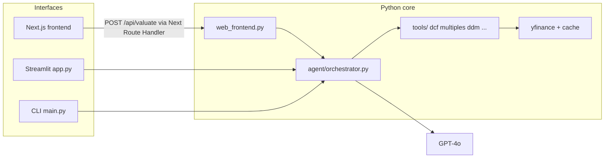

# Valuation Agent

**GPT‑4o** orchestrates repeatable equity research: **DCF**, **relative multiples**, **dividend discount (DDM)** (when applicable), optional **sum‑of‑parts (SOTP)** for selected tickers, and **analyst-price context** from **yfinance**. Works for major **US-listed** stocks and **Warsaw GPW** (`.WA` tickers).

| Entry points | Purpose |
|----------------|----------|
| [`main.py`](main.py) | Full **tool‑use agent loop** → long Markdown report |
| [`app.py`](app.py) | **Streamlit** dashboard (DCF sliders + Plotly charts) |
| [`frontend/`](frontend/) | **Next.js 15** browser UI (calls Python API via proxy) |
| [`web_frontend.py`](web_frontend.py) | **HTTP JSON API** for the Next app (`POST /api/valuate`) |

English investor-facing narratives; persisted tool JSON still uses legacy **Polish field names** — the model is instructed to read them and write reports in English. Educational / portfolio demo only — **not** investment advice.

[](https://www.python.org/downloads/)
[](https://nextjs.org/)
[](LICENSE)

**Repository:** [github.com/Tomekw2323/ValuationAgent](https://github.com/Tomekw2323/ValuationAgent)

---

## Quick start (Python)

```bash
git clone https://github.com/Tomekw2323/ValuationAgent.git
cd ValuationAgent
python -m venv .venv

# Windows
.venv\Scripts\activate
copy .env.example .env

# macOS / Linux
# source .venv/bin/activate
# cp .env.example .env

pip install -r requirements.txt
# Set OPENAI_API_KEY or AZURE_OPENAI_* in .env — see Configuration below.
```

**Streamlit**

```bash
streamlit run app.py
```

**CLI** (GPT tool loop + terminal report; `--save` writes Markdown — and PDF when ReportLab succeeds — under `reports/`)

```bash
python main.py AAPL
python main.py PKN.WA --fresh
python main.py CDR.WA --save --verbose
```

---

## Quick start (Next.js UI + API)

Two processes are required: the Python valuation API and the Next.js dev server.

**Terminal A — valuation API**

```bash
python web_frontend.py
# Default: http://127.0.0.1:8000  ·  Override with WEB_HOST / WEB_PORT
```

**Terminal B — web UI**

```bash
cd frontend
npm ci          # or: npm install
cp .env.example .env.local     # optional
npm run dev
# Open http://127.0.0.1:3000
```

| Environment | Meaning |
|-------------|---------|
| Root [`.env`](.env.example) | LLM + yfinance use (never commit `.env`) |
| [`frontend/.env.local`](frontend/.env.example) | `VALUATION_API_URL` — defaults to `http://127.0.0.1:8000` |

Production-style run for the frontend: `npm run build && npm run start` (still needs the Python API reachable at `VALUATION_API_URL`).

See **[docs/HTTP_API.md](docs/HTTP_API.md)** for request/response JSON and **[docs/FRONTENDS.md](docs/FRONTENDS.md)** for how CLI / Streamlit / Next.js differ.

---

## Architecture (high level)



---

## Repository layout

```
ValuationAgent/
  agent/              # GPT-4o prompts, orchestration (tool loop + run_final flow)
  frontend/           # Next.js App Router UI + `/api/valuate` proxy
  tools/              # yfinance fetch, DCF, multiples, DDM, SOTP
  report/             # Rich terminal, Markdown/PDF export
  data/               # validators, file cache helpers
  tests/
  docs/               # Extra documentation (API, frontends)
  web/                # Notes / optional static assets
  web_frontend.py     # ThreadingHTTPServer JSON API
  app.py              # Streamlit
  main.py             # CLI
  config.py
```

---

## Configuration

LLM backends (via [`config.py`](config.py)):

| Provider | Variables |
|----------|-----------|
| **OpenAI** | `OPENAI_API_KEY`, optional `OPENAI_MODEL` (default `gpt-4o`) |
| **Azure OpenAI** | `AZURE_OPENAI_ENDPOINT`, `AZURE_OPENAI_API_KEY`, `AZURE_OPENAI_DEPLOYMENT`, `AZURE_OPENAI_API_VERSION` |

Do **not** commit `.env`. Use [`.env.example`](.env.example) as a template.

---

## Development

```bash
pytest tests/ -q
```

```bash
cd frontend && npm run build
```

---

## Cost ballpark

A full **`main.py`** run is often on the order of **6–8** API round-trips (~**8k–12k** input tokens, ~**1.2k–1.8k** output for GPT‑4o-class models — check current pricing). The **Streamlit / Next.js** path uses `run_preliminary` + `run_final` (fewer calls than the full CLI tool loop for the narrative step). Watch logs if you hit iteration limits.

---

## Limitations

1. **yfinance** — delayed or incomplete data, especially on smaller / GPW names.  
2. **GPW discount heuristics** — rules of thumb, not calibrated econometrics.  
3. **Banks / insurers** — FCF-based DCF is often wrong; agent is steered toward book / DDM when flagged.  
4. **Gaming / cyclicals** — FCF timing; reliance on multiples and labelled uncertainty.  
5. **SOTP** — static segment assumptions for demo tickers (e.g. AMZN, GOOGL).

---

## License

[MIT](LICENSE)

---

## Disclaimer

This software is provided **for education and experimentation only**. It is **not** investment, tax, or legal advice. You are responsible for complying with market rules and third-party API terms wherever you run it.
